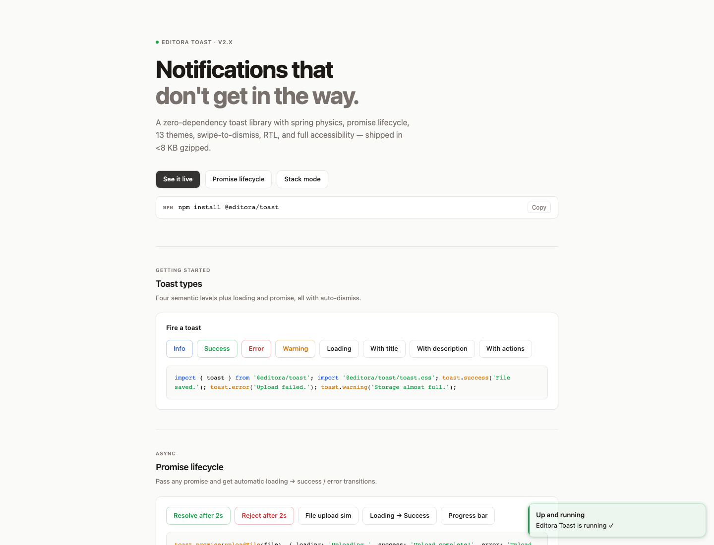
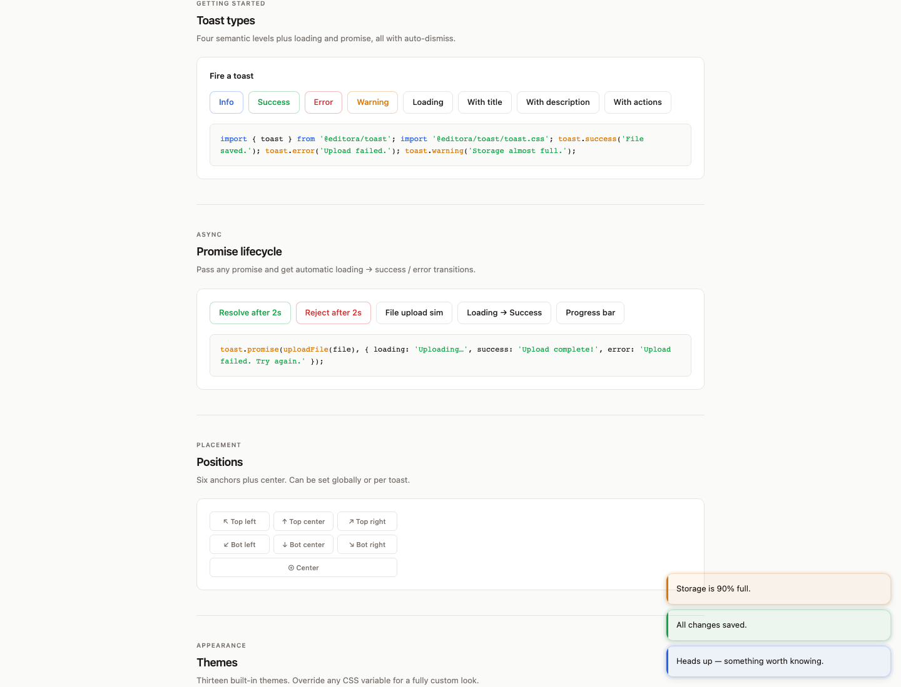
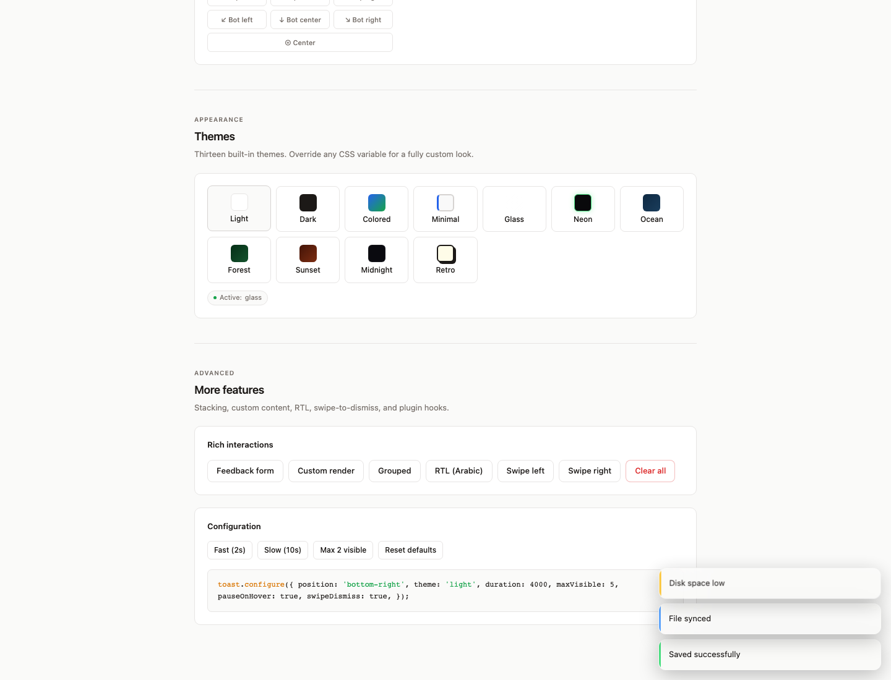
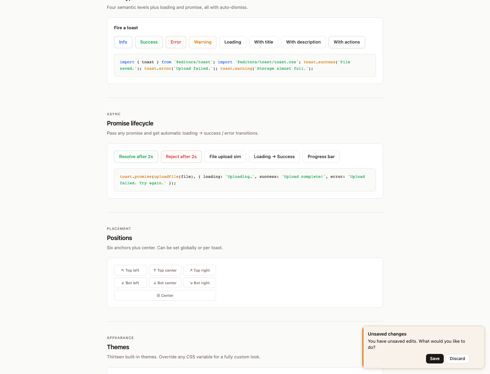
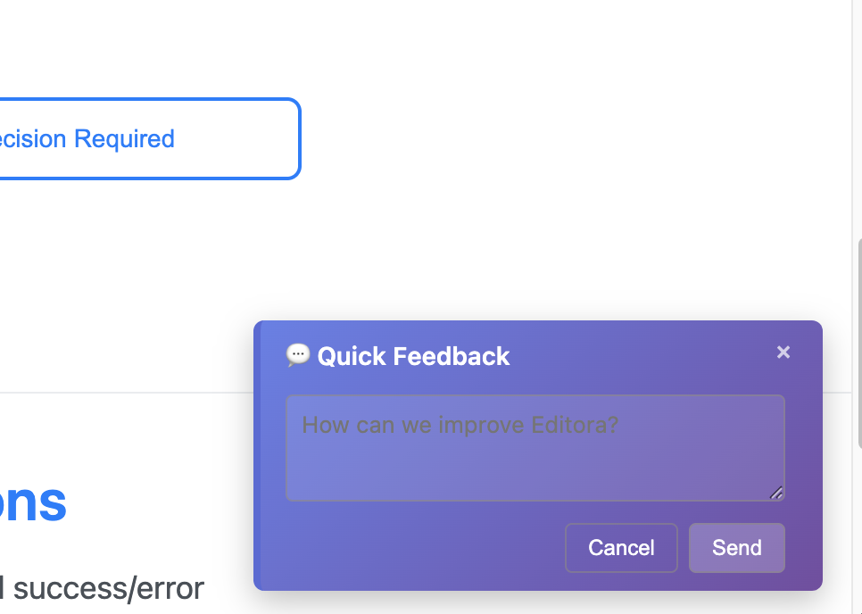
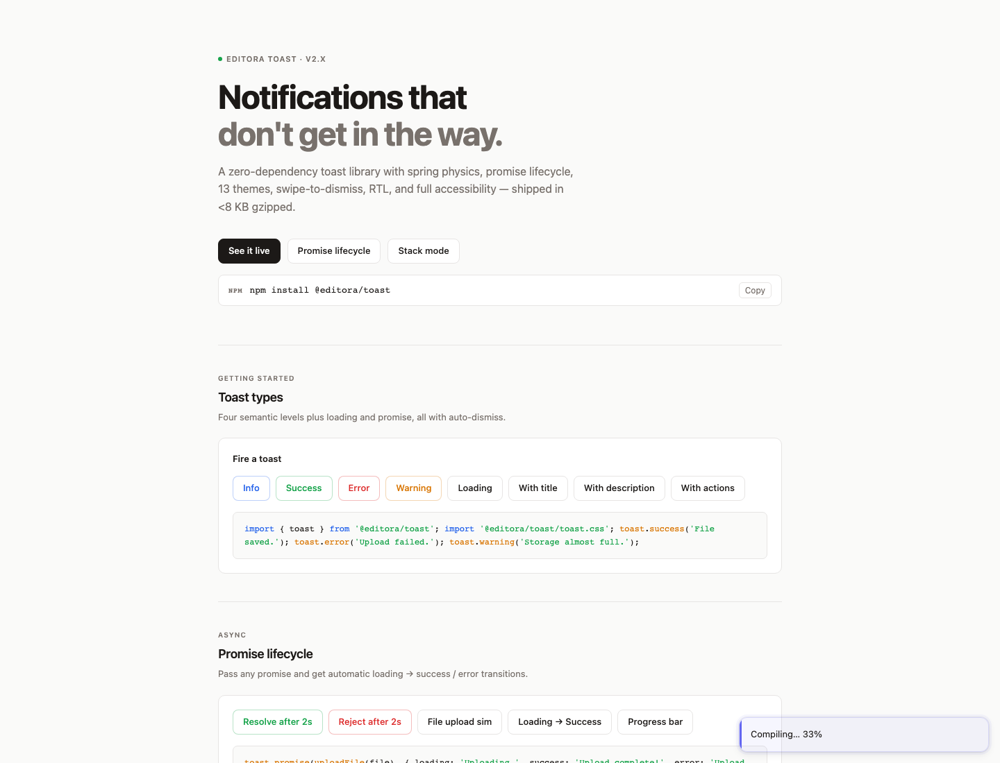
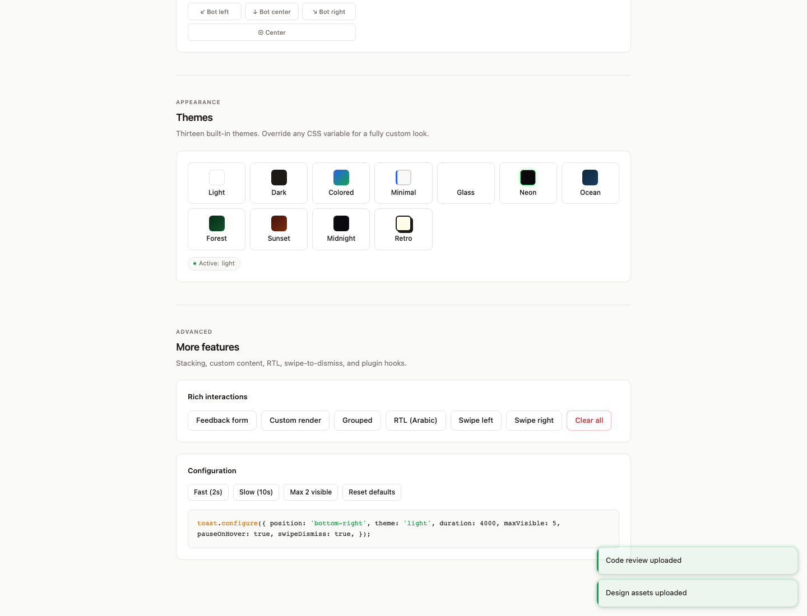
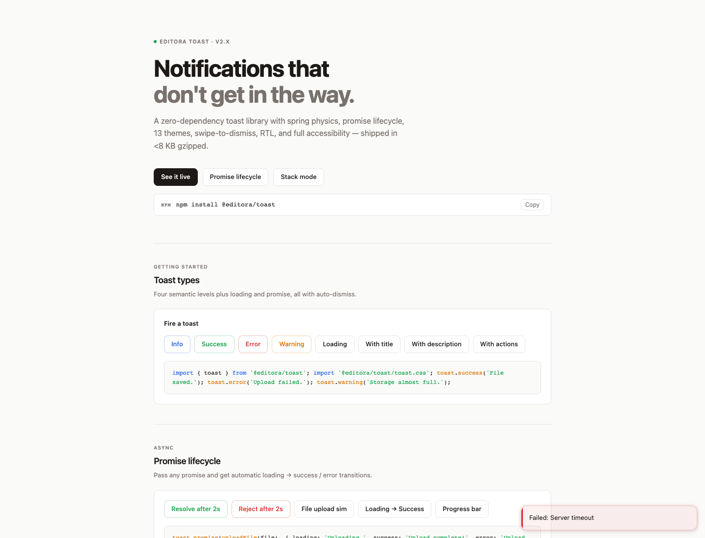

# Editora Toast

> [!IMPORTANT]
> **Live Website:** https://editora-ecosystem.netlify.app/  
> **Storybook:** https://editora-ecosystem-storybook.netlify.app/


> Advanced toast notification system with enterprise features, backward compatibility, and rich customization options.

[](https://www.npmjs.com/package/@editora/toast)
[](https://github.com/ajaykr089/Editora/blob/main/LICENSE)
[](https://www.typescriptlang.org/)
[](https://bundlephobia.com/package/@editora/toast)

A modern, framework-agnostic toast notification library designed for enterprise applications. Features advanced UX patterns, accessibility compliance, plugin architecture, and seamless integration with rich text editors.

## 📸 Screenshots

### Hero Section


### Basic Toast Types


### Beautiful Themes


### Interactive Actions


### Interactive Feedback Form


### Progress Scenarios


### Advanced Features


### Async Operations


### Error Handling


## ✨ Features

### Core Features
- 🚀 **Framework Agnostic** - Works with any JavaScript framework or vanilla JS
- ♿ **Accessibility First** - WCAG AA compliant with screen reader support
- 🔄 **Promise Lifecycle** - Automatic state transitions for async operations
- 📱 **Mobile Optimized** - Touch gestures, swipe-to-dismiss, and responsive design
- 🎨 **Advanced Theming** - 13 built-in themes with CSS variables and custom themes
- 🔌 **Plugin Architecture** - Extensible with custom plugins and hooks
- 📊 **Smart Queue Management** - Priority-based queuing with overflow strategies
- 🎯 **Rich Content Support** - HTML, icons, actions, progress bars, and custom rendering
- 🎪 **Spring Physics Animations** - Realistic animations with customizable physics parameters
- 🏗️ **SSR Safe** - Server-side rendering compatible
- 🪝 **Editor Integration** - Built-in hooks for rich text editors
- 🔒 **Security** - HTML sanitization and XSS protection
- 📦 **Zero Dependencies** - Lightweight and self-contained

### Advanced Features (v2.0.0)
- 🔄 **Toast Updates** - Modify existing toasts dynamically with smooth transitions
- 🎯 **Toast Grouping** - Group related notifications with stacking and management
- 🎪 **Custom Animation Hooks** - User-defined animation functions for complete control
- 📍 **Multiple Positions** - Support for all screen corners and center positioning
- 🎨 **Animation Manager** - Centralized system supporting CSS, spring, and custom animations
- 📱 **Gesture Support** - Swipe and drag gestures for mobile interaction
- 🎯 **Focus Management** - Proper keyboard navigation and focus handling
- 🔄 **Promise Integration** - Seamless integration with async operations and promises
- 📊 **Progress Tracking** - Built-in progress bars with percentage display
- 🎯 **Action Buttons** - Interactive buttons within toasts for user actions
- 🎨 **Theme Variants** - Light, dark, system, colored, minimal, glass, neon, retro, ocean, forest, sunset, midnight themes
- 🔧 **Global Configuration** - Comprehensive configuration system for all aspects

### Performance & Architecture

- ⚡ **Optimized Queue Management** - O(1) insertion with priority-based queuing
- 🎯 **Batched DOM Updates** - Efficient rendering with minimal reflows
- 🧠 **Memory Safe** - Automatic cleanup and leak prevention
- 🚀 **Virtualized Rendering** - Handles large queues without performance degradation
- 🔄 **Event-Driven Architecture** - Plugin system with comprehensive hooks
- 📦 **Tree-Shakable** - Import only what you need for smaller bundles

## 📦 Installation

```bash
npm install @editora/toast
```

## 🌐 CDN Usage

You can also use Editora Toast directly from a CDN without installing it via npm. Include the following scripts in your HTML:
### Examples
``` https://editora-ecosystem.netlify.app/toast-demo.html ```
### Basic CDN Setup

```html
<!DOCTYPE html>
<html lang="en">
<head>
  <meta charset="UTF-8">
  <meta name="viewport" content="width=device-width, initial-scale=1.0">
  <title>My App</title>
  
  <!-- Include the CSS -->
  <link rel="stylesheet" href="https://cdn.jsdelivr.net/npm/@editora/toast@latest/dist/toast.css">
</head>
<body>
  <!-- Your content here -->
  
  <!-- Include the JavaScript -->
  <script src="https://cdn.jsdelivr.net/npm/@editora/toast@latest/dist/index.umd.js"></script>
  
  <script>
    // Now you can use the toast functions (legacy API supports an optional options object)
    toast.success('Hello from CDN!', { theme: 'light', position: 'top-right' });
    toast.error('Something went wrong!', { duration: 1000 });
    toast.info('This is an info message', { theme: 'light', position: 'top-right' });
    toast.warning('This is a warning', { theme: 'light', position: 'top-right' });
    
    // Advanced usage (toastAdvanced, toastPro)
    // global window.toastPro.show()
    // global window.toastAdvanced.show()
    const notification = toastAdvanced.show({
      message: 'File uploaded successfully!',
      level: 'success',
      icon: '✓',
      actions: [
        { label: 'View', onClick: () => console.log('View clicked') },
        { label: 'Dismiss', onClick: () => notification.dismiss() }
      ]
    });
    const notification = toastPro.show({
      message: 'File uploaded successfully!',
      level: 'success',
      icon: '✓',
      actions: [
        { label: 'View', onClick: () => console.log('View clicked') },
        { label: 'Dismiss', onClick: () => notification.dismiss() }
      ]
    });
  </script>
</body>
</html>
```

### CDN URLs

- **JavaScript**: `https://cdn.jsdelivr.net/npm/@editora/toast@latest/dist/index.umd.js`
- **CSS**: `https://cdn.jsdelivr.net/npm/@editora/toast@latest/dist/toast.css`

> **Note**: Replace `@latest` with a specific version number (e.g., `@2.0.0`) for production use to avoid unexpected updates.

## 🚀 Quick Start

### Basic Usage (Backward Compatible)

```typescript
import { toast } from '@editora/toast';
import "@editora/toast/toast.css";

// Simple notifications (migrated to optional advanced options)
toast.success('File saved successfully!', { theme: 'light', position: 'top-right' });
toast.error('Failed to save file', { theme: 'light', position: 'top-right' });
toast.info('Info message', { theme: 'light', position: 'top-right' });
toast.warning('Warning message', { theme: 'light', position: 'top-right' });
```

### Advanced Usage (v2.0.0 Features)

```typescript
import { toastAdvanced as toast } from '@editora/toast';
import "@editora/toast/toast.css";
// Rich notifications with actions and progress
const notification = toast.show({
  message: 'Document uploaded successfully!',
  level: 'success',
  icon: '✓',
  actions: [
    { label: 'View Document', onClick: () => console.log('View clicked') },
    { label: 'Share', onClick: () => console.log('Share clicked') },
    { label: 'Dismiss', onClick: () => notification.dismiss() }
  ],
  progress: { value: 100, showPercentage: true },
  duration: 6000
});

// Promise-based notifications with automatic state transitions
toast.promise(
  uploadFile(file),
  {
    loading: 'Uploading file...',
    success: (data) => `File "${data.name}" uploaded successfully!`,
    error: (error) => `Upload failed: ${error.message}`
  }
);

// Update existing toast dynamically
const loadingToast = toast.loading('Saving document...');
setTimeout(() => {
  toast.update(loadingToast.id, {
    message: 'Document saved successfully!',
    level: 'success',
    icon: '💾',
    actions: [{ label: 'Open', onClick: () => {} }]
  });
}, 2000);

// Group related notifications
toast.group('file-operations', {
  message: 'File 1 processed',
  level: 'success'
});

toast.group('file-operations', {
  message: 'File 2 processed',
  level: 'success'
});
```

## 🎛️ Configuration

```typescript
import { toastAdvanced as toast } from '@editora/toast';
import "@editora/toast/toast.css";
// Global configuration with all available options
toast.configure({
  // Positioning
  position: 'top-right', // 'top-left' | 'top-right' | 'bottom-left' | 'bottom-right' | 'center'

  // Timing
  duration: 5000, // Default duration in milliseconds
  pauseOnHover: true, // Pause timer when hovering

  // Display
  maxVisible: 5, // Maximum visible toasts
  theme: 'system', // Theme: 'light' | 'dark' | 'system' | 'colored' | 'minimal' | 'glass' | 'neon' | 'retro' | 'ocean' | 'forest' | 'sunset' | 'midnight' | 'custom'

  // Accessibility
  enableAccessibility: true, // Enable screen reader support
  enableKeyboardNavigation: true, // Enable keyboard navigation

  // Interactions
  swipeDismiss: true, // Enable swipe to dismiss on mobile
  dragDismiss: false, // Enable drag to dismiss
  clickToDismiss: true, // Click anywhere to dismiss

  // Queue Management
  queueStrategy: 'priority', // 'fifo' | 'priority' | 'stack'
  maxQueueSize: 10, // Maximum queued toasts

  // Animations
  animation: {
    type: 'spring', // 'css' | 'spring' | 'custom'
    config: {
      stiffness: 120,
      damping: 12,
      mass: 1,
      precision: 0.01
    }
  },

  // Advanced
  enableHtml: false, // Allow HTML in messages (use with caution)
  sanitizeHtml: true, // Sanitize HTML content
  zIndex: 9999, // Base z-index for toasts
  containerClass: 'custom-container' // Custom container class
});
```

## 🎨 Theming


### Built-in Themes

Editora Toast comes with 13 beautiful themes:

- **`light`** - Clean white background with subtle shadows
- **`dark`** - Dark background with high contrast text
- **`system`** - Automatically switches between light/dark based on system preference
- **`colored`** - Vibrant gradient backgrounds for each toast level
- **`minimal`** - Clean design with subtle borders and minimal styling
- **`glass`** - Frosted glass effect with backdrop blur
- **`neon`** - Bright neon colors with glowing effects
- **`retro`** - 80s/90s style with bold colors and gradients
- **`ocean`** - Blue aquatic theme with calming colors
- **`forest`** - Green natural theme with earthy tones
- **`sunset`** - Warm orange/pink sunset colors
- **`midnight`** - Deep blue dark theme with subtle gradients
- **`custom`** - Fully customizable with CSS variables

### Usage

```typescript
import { toastAdvanced as toast } from '@editora/toast';
import "@editora/toast/toast.css";
// Set global theme
toast.configure({
  theme: 'glass'  // or 'neon', 'retro', 'ocean', etc.
});

// Per-toast theme
toast.show({
  message: 'Hello World',
  theme: 'colored'
});
```

### CSS Variables

```css
:root {
  --editora-toast-bg: rgba(0, 0, 0, 0.85);
  --editora-toast-color: #fff;
  --editora-toast-shadow: 0 6px 18px rgba(0, 0, 0, 0.25);
  --editora-toast-border-radius: 6px;
  --editora-toast-font-family: system-ui, -apple-system, 'Segoe UI', Roboto;
  --editora-toast-font-size: 13px;
  --editora-toast-padding: 10px 14px;
}
```

### Theme Classes

```html
<!-- Apply theme globally -->
<div data-theme="glass">
  <!-- All toasts will use glass theme -->
</div>

<!-- Or apply to specific container -->
<div class="editora-toast-container" data-theme="neon">
</div>
```

## 🎯 Advanced Features

### Promise Lifecycle Toasts


Automatically handle async operations with state transitions:

```typescript
import { toastAdvanced as toast } from '@editora/toast';

// Promise-based notifications
const uploadPromise = uploadFile(file);

toast.promise(uploadPromise, {
  loading: {
    message: 'Uploading file...',
    icon: '⏳',
    progress: { indeterminate: true }
  },
  success: {
    message: 'File uploaded successfully!',
    icon: '✅',
    duration: 4000,
    actions: [{ label: 'View', onClick: () => openFile() }]
  },
  error: {
    message: 'Upload failed. Please try again.',
    icon: '❌',
    duration: 6000,
    actions: [
      { label: 'Retry', onClick: () => retryUpload() },
      { label: 'Cancel', onClick: () => {} }
    ]
  }
});
```

### Interactive Actions


Add interactive buttons to your toasts:

```typescript
import { toastAdvanced as toast } from '@editora/toast';
import "@editora/toast/toast.css";
const notification = toast.show({
  message: 'Document saved successfully!',
  level: 'success',
  icon: '💾',
  actions: [
    {
      label: 'Open Document',
      onClick: () => openDocument(),
      primary: true // Primary action styling
    },
    {
      label: 'Share',
      onClick: () => shareDocument(),
      variant: 'secondary'
    },
    {
      label: 'Dismiss',
      onClick: () => notification.dismiss(),
      variant: 'ghost'
    }
  ],
  duration: 8000 // Longer duration for actions
});
```

### Progress Tracking


Built-in progress bars with customizable display:

```typescript
import { toastAdvanced as toast } from '@editora/toast';
import "@editora/toast/toast.css";
// Determinate progress
const progressToast = toast.show({
  message: 'Processing files...',
  level: 'info',
  progress: {
    value: 0,
    showPercentage: true,
    color: '#007acc'
  }
});

// Update progress
let progress = 0;
const interval = setInterval(() => {
  progress += 10;
  toast.update(progressToast.id, {
    progress: { value: progress, showPercentage: true },
    message: `Processing files... ${progress}%`
  });

  if (progress >= 100) {
    clearInterval(interval);
    toast.update(progressToast.id, {
      message: 'Processing complete!',
      level: 'success',
      progress: { value: 100, showPercentage: true }
    });
  }
}, 500);
```

### Toast Updates


Modify existing toasts dynamically:

```typescript
import { toastAdvanced as toast } from '@editora/toast';
import "@editora/toast/toast.css";
// Create a loading toast
const loadingToast = toast.loading('Connecting to server...');

// Update with progress
setTimeout(() => {
  toast.update(loadingToast.id, {
    message: 'Authenticating...',
    progress: { value: 25, showPercentage: true }
  });
}, 1000);

// Update with success
setTimeout(() => {
  toast.update(loadingToast.id, {
    message: 'Connected successfully!',
    level: 'success',
    icon: '🔗',
    progress: { value: 100, showPercentage: true },
    actions: [{ label: 'Explore', onClick: () => {} }]
  });
}, 2000);
```

### Toast Grouping


Group related notifications together:

```typescript
import { toastAdvanced as toast } from '@editora/toast';
import "@editora/toast/toast.css";
// Group file operations
const files = ['document.pdf', 'image.jpg', 'data.json'];

files.forEach((file, index) => {
  setTimeout(() => {
    toast.group('file-upload', {
      message: `Uploaded ${file}`,
      level: 'success',
      icon: '📁',
      duration: 3000
    });
  }, index * 500);
});

// Group error notifications
toast.group('validation-errors', {
  message: 'Invalid email format',
  level: 'error',
  icon: '⚠️'
});

toast.group('validation-errors', {
  message: 'Password too weak',
  level: 'error',
  icon: '🔒'
});
```

### Interactive Feedback Forms


Create interactive forms within toasts:

```typescript
import { toastAdvanced as toast } from '@editora/toast';
import "@editora/toast/toast.css";
toast.show({
  message: 'How was your experience?',
  level: 'info',
  icon: '⭐',
  render: () => {
    const container = document.createElement('div');
    container.innerHTML = `
      <div style="display: flex; gap: 8px; margin-top: 8px;">
        <button class="feedback-btn" data-rating="1">😞</button>
        <button class="feedback-btn" data-rating="2">😐</button>
        <button class="feedback-btn" data-rating="3">😊</button>
        <button class="feedback-btn" data-rating="4">😃</button>
        <button class="feedback-btn" data-rating="5">😍</button>
      </div>
    `;

    container.addEventListener('click', (e) => {
      if (e.target.classList.contains('feedback-btn')) {
        const rating = e.target.dataset.rating;
        submitFeedback(rating);
        toast.success('Thank you for your feedback!');
      }
    });

    return container;
  },
  duration: 10000
});
```

## 🔌 Plugins

```typescript
import { toastAdvanced as toast } from '@editora/toast';
import "@editora/toast/toast.css";
const myPlugin = {
  name: 'my-plugin',
  install(manager) {
    // Add custom functionality
    manager.on('beforeShow', (toast) => {
      console.log('Toast about to show:', toast.message);
    });
  }
};

toast.use(myPlugin);
```

## 📱 Positions

```typescript
toast.show({
  message: 'Hello World',
  position: 'top-left' | 'top-right' | 'bottom-left' | 'bottom-right' | 'center'
});
```

## 🎪 Advanced Features

### Spring Physics Animations

```typescript
import { toastAdvanced as toast } from '@editora/toast';
import "@editora/toast/toast.css";
// Spring animation with custom physics
toast.show({
  message: 'Spring animated toast!',
  level: 'success',
  animation: {
    type: 'spring',
    config: {
      stiffness: 120,  // Spring stiffness (default: 100)
      damping: 12,     // Spring damping (default: 10)
      mass: 1,         // Spring mass (default: 1)
      precision: 0.01  // Animation precision (default: 0.01)
    }
  }
});
```

### Custom Animation Hooks

```typescript
import { toastAdvanced as toast } from '@editora/toast';
import "@editora/toast/toast.css";
// Custom animation functions
toast.show({
  message: 'Custom animated toast!',
  level: 'info',
  animation: {
    type: 'custom',
    show: async (element, toast) => {
      // Custom show animation
      element.style.opacity = '0';
      element.style.transform = 'rotateX(90deg)';

      await new Promise(resolve => {
        element.style.transition = 'all 0.5s ease';
        element.style.opacity = '1';
        element.style.transform = 'rotateX(0deg)';
        element.addEventListener('transitionend', resolve, { once: true });
      });
    },
    hide: async (element, toast) => {
      // Custom hide animation
      element.style.transition = 'all 0.3s ease';
      element.style.opacity = '0';
      element.style.transform = 'scale(0.8)';

      return new Promise(resolve => {
        setTimeout(resolve, 300);
      });
    },
    update: async (element, toast, updates) => {
      // Custom update animation
      element.style.transform = 'scale(1.05)';
      setTimeout(() => {
        element.style.transform = 'scale(1)';
      }, 150);
    }
  }
});
```

### Global Animation Configuration

```typescript
import { toastAdvanced as toast } from '@editora/toast';
import "@editora/toast/toast.css";
// Set default animation for all toasts
toast.configure({
  animation: {
    type: 'spring',
    config: { stiffness: 150, damping: 15 }
  }
});
```

### Toast Groups

```typescript
// Group related notifications
toast.group('upload-group', {
  message: 'Upload 1 complete',
  level: 'success'
});

toast.group('upload-group', {
  message: 'Upload 2 complete',
  level: 'success'
});
```

### Custom Render Function

```typescript
toast.show({
  render: () => {
    const div = document.createElement('div');
    div.innerHTML = '<strong>Custom</strong> content';
    return div;
  }
});
```

### Editor Integration

```typescript
import { toastAdvanced as toast } from '@editora/toast';
import "@editora/toast/toast.css";
// Listen for editor events
toast.onEditorEvent('spellcheck-error', (error) => {
  toast.error(`Spelling error: ${error.word}`, { theme: 'light', position: 'top-right' });
});

// Trigger editor events
toast.triggerEditorEvent('media-upload-progress', { progress: 50 });
```

## 📋 API Reference

### Core Methods

- `toast.show(options)` - Show a toast with full options
- `toast.update(id, options)` - Update an existing toast dynamically
- `toast.dismiss(id?)` - Dismiss a specific toast or all toasts
- `toast.clear()` - Clear all visible toasts

### Convenience Methods

- `toast.info(message, options?)` - Info level toast
- `toast.success(message, options?)` - Success level toast
- `toast.error(message, options?)` - Error level toast
- `toast.warning(message, options?)` - Warning level toast
- `toast.loading(message, options?)` - Loading state toast

### Advanced Methods (v2.0.0)

- `toast.promise(promise, options)` - Promise lifecycle toasts with automatic state transitions
- `toast.group(id, options)` - Group related toasts with stacking behavior
- `toast.configure(config)` - Update global configuration
- `toast.use(plugin)` - Install a plugin
- `toast.onEditorEvent(event, handler)` - Listen for editor integration events
- `toast.triggerEditorEvent(event, data)` - Trigger editor integration events

### Toast Options Interface

```typescript
interface ToastOptions {
  // Content
  message: string;
  level?: 'info' | 'success' | 'error' | 'warning' | 'loading' | 'progress' | 'promise' | 'custom';
  icon?: string;
  html?: boolean;
  render?: () => HTMLElement;

  // Behavior
  duration?: number;
  pauseOnHover?: boolean;
  clickToDismiss?: boolean;

  // Positioning
  position?: 'top-left' | 'top-right' | 'bottom-left' | 'bottom-right' | 'center';

  // Interactions
  actions?: ToastAction[];
  swipeDismiss?: boolean;
  dragDismiss?: boolean;

  // Progress
  progress?: ToastProgress;

  // Styling
  theme?: string;
  className?: string;

  // Advanced
  groupId?: string;
  priority?: number;
  animation?: ToastAnimation;
  onShow?: (toast: Toast) => void;
  onHide?: (toast: Toast) => void;
  onUpdate?: (toast: Toast, updates: Partial<ToastOptions>) => void;
}

interface ToastAction {
  label: string;
  onClick: (toast: Toast) => void;
  variant?: 'primary' | 'secondary' | 'ghost';
  primary?: boolean;
}

interface ToastProgress {
  value: number; // 0-100
  showPercentage?: boolean;
  indeterminate?: boolean;
  color?: string;
  size?: 'sm' | 'md' | 'lg';
}

interface ToastAnimation {
  type: 'css' | 'spring' | 'custom';
  config?: SpringConfig;
  show?: AnimationFunction;
  hide?: AnimationFunction;
  update?: AnimationFunction;
}
```

## 🎮 Live Demo & Examples

Try out all the features with our comprehensive demo:

```bash
# Clone the repository
git clone https://github.com/ajaykr089/Editora.git
cd Editora/packages/editora-toast

# Install dependencies
npm install

# Start the demo server
npm run demo
# or
python3 -m http.server 8086
# Then open: http://localhost:8086/examples/web/toast-demo.html
```

The demo showcases:
- ✅ All 13 built-in themes
- 🎯 Interactive actions and buttons
- 📊 Progress bars and indicators
- 🔄 Promise lifecycle management
- 🎪 Spring physics animations
- 📱 Mobile gestures and touch support
- ♿ Accessibility features
- 🎨 Custom rendering and HTML content
- 📱 Responsive design across devices

## 🔧 Build & Development

```bash
# Install dependencies
npm install

# Build
npm run build

# Development watch
npm run dev

# Clean
npm run clean
```

## 🌍 Browser Support

- Chrome 60+
- Firefox 55+
- Safari 12+
- Edge 79+

## 📄 License

MIT © [Ajay Kumar](https://github.com/ajaykr089)

## 🤝 Contributing

Contributions welcome! Please see the [main repository](https://github.com/ajaykr089/Editora) for contribution guidelines.

## 📚 Migration Guide

### From v1.x to v2.0.0

The v2.0.0 release introduces powerful new features while maintaining **full backward compatibility**. Your existing code will continue to work without changes.

#### ✨ New Features in v2.0.0

```typescript
// v1.x (still works)
import { toast } from '@editora/toast';
import "@editora/toast/toast.css";
toast.success('Hello World', { theme: 'light', position: 'top-right' });

// v2.0.0 advanced features
import { toastAdvanced as toast } from '@editora/toast';
import "@editora/toast/toast.css";
// Promise lifecycle toasts
toast.promise(fetchData(), {
  loading: 'Loading...',
  success: 'Data loaded!',
  error: 'Failed to load'
});

// Rich content with actions
toast.show({
  message: 'File uploaded!',
  level: 'success',
  icon: '✅',
  actions: [
    { label: 'View', onClick: () => {} },
    { label: 'Share', onClick: () => {} }
  ],
  progress: { value: 100, showPercentage: true }
});

// Dynamic toast updates
const toast = toast.loading('Saving...');
toast.update(toast.id, { message: 'Saved!', level: 'success' });

// Toast grouping
toast.group('operations', { message: 'Task 1 complete', level: 'success' });
toast.group('operations', { message: 'Task 2 complete', level: 'success' });
```

#### Configuration Changes

```typescript
// New configuration options in v2.0.0
toast.configure({
  theme: 'system', // New themes: glass, neon, retro, ocean, etc.
  swipeDismiss: true, // Mobile gesture support
  dragDismiss: false,
  animation: {
    type: 'spring', // New spring physics animations
    config: { stiffness: 120, damping: 12 }
  },
  queueStrategy: 'priority', // Priority-based queuing
  enableKeyboardNavigation: true // Enhanced accessibility
});
```

For more detailed migration information, see the [migration guide](./MIGRATION_GUIDE.md).
