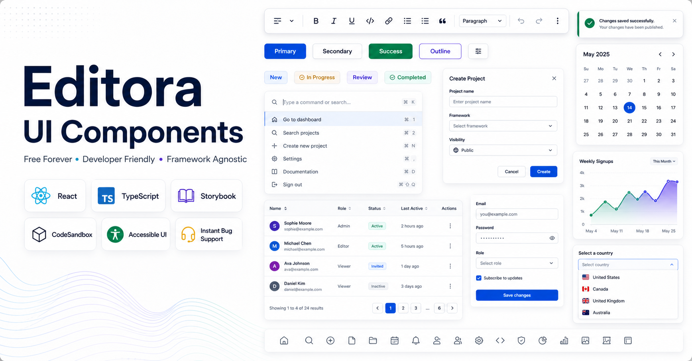

# @editora/ui-react

[](https://www.npmjs.com/package/@editora/ui-react)
[](https://github.com/ajaykr089/Editora/blob/main/LICENSE)
[](https://www.typescriptlang.org/)
[](https://bundlephobia.com/package/@editora/ui-react)



## Demos

- **CodeSandbox:** https://codesandbox.io/p/github/ajaykr089/editora-codesandbox/main
- **CodeSandboxUI Components:** https://qjr47y-5173.csb.app/button
- **UI Component Catalog:** https://editora-ecosystem.netlify.app/
- **Web Demo:** https://editora-free.netlify.app/
- **Storybook:** https://editora-ecosystem-storybook.netlify.app/

React wrappers for `@editora/ui-core` Web Components.

This package gives React-friendly props, typed callback details, and hooks/providers for form and dialog workflows.

## Installation

```bash
npm install @editora/ui-react @editora/ui-core
```

If you only need sortable as a standalone package, use:

```bash
npm install @editora/ui-sortable
```

And for the standalone React wrapper only:

```tsx
import { Sortable } from '@editora/ui-sortable/react';
```

Peer dependencies:
- `react`
- `react-dom`

## Quick Start

Import from package root. This also registers all custom elements (`import '@editora/ui-core'`) internally.

```tsx
import { Button, Input, ThemeProvider } from '@editora/ui-react';

export function App() {
  return (
    <ThemeProvider>
      <div style={{ display: 'grid', gap: 12, maxWidth: 360 }}>
        <Input name="title" label="Title" placeholder="Untitled" clearable />
        <Button variant="primary">Save</Button>
      </div>
    </ThemeProvider>
  );
}
```

## Important Import Rule

Recommended:

```ts
import { Button, DataTable } from '@editora/ui-react';
```

If you deep-import wrappers directly (not recommended), ensure custom elements are registered:

```ts
import '@editora/ui-core';
```

## Common Usage Examples

### 1. Form + `useForm`

```tsx
import { Form, Field, Input, Button, useForm } from '@editora/ui-react';

export function ProfileForm() {
  const { ref, submit, validate, getValues, reset, isDirty } = useForm();

  return (
    <Form
      ref={ref}
      autosave
      guardUnsaved
      onSubmit={(values) => console.log('submit', values)}
      onInvalid={(errors) => console.log('invalid', errors)}
      style={{ display: 'grid', gap: 12, maxWidth: 520 }}
    >
      <Field label="Full name" required>
        <Input name="fullName" required />
      </Field>

      <Field label="Email" required>
        <Input name="email" type="email" required />
      </Field>

      <div style={{ display: 'flex', gap: 8 }}>
        <Button variant="secondary" onClick={() => validate()}>Validate</Button>
        <Button variant="secondary" onClick={() => console.log(getValues())}>Values</Button>
        <Button variant="secondary" onClick={() => reset()}>Reset</Button>
        <Button onClick={() => submit()} disabled={!isDirty()}>Submit</Button>
      </div>
    </Form>
  );
}
```

### 2. Promise dialogs with provider hooks

```tsx
import { DialogProvider, useDialog, AlertDialogProvider, useAlertDialog, Button } from '@editora/ui-react';

function Actions() {
  const dialog = useDialog();
  const alerts = useAlertDialog();

  return (
    <div style={{ display: 'flex', gap: 8 }}>
      <Button
        onClick={async () => {
          const res = await dialog.confirm({
            title: 'Archive project?',
            description: 'You can restore it later.',
            submitText: 'Archive'
          });
          console.log(res);
        }}
      >
        Confirm
      </Button>

      <Button
        variant="secondary"
        onClick={async () => {
          const res = await alerts.prompt({
            title: 'Rename',
            input: { required: true, placeholder: 'New name' }
          });
          console.log(res);
        }}
      >
        Prompt
      </Button>
    </div>
  );
}

export function DialogExample() {
  return (
    <DialogProvider>
      <AlertDialogProvider>
        <Actions />
      </AlertDialogProvider>
    </DialogProvider>
  );
}
```

### 3. Data table (sorting, selection, paging, filters)

```tsx
import { DataTable, Pagination } from '@editora/ui-react';
import { useState } from 'react';

export function UsersTable() {
  const [page, setPage] = useState(1);

  return (
    <div style={{ display: 'grid', gap: 10 }}>
      <DataTable
        sortable
        selectable
        resizableColumns
        draggableColumns
        page={page}
        pageSize={10}
        paginationId="users-pager"
        onPageChange={(d) => setPage(d.page)}
        onSortChange={(d) => console.log('sort', d)}
        onRowSelect={(d) => console.log('rows', d.indices)}
      >
        <table>
          <thead>
            <tr>
              <th data-key="id">ID</th>
              <th data-key="name">Name</th>
              <th data-key="role">Role</th>
            </tr>
          </thead>
          <tbody>
            <tr><td>1</td><td>Asha</td><td>Admin</td></tr>
            <tr><td>2</td><td>Marco</td><td>Editor</td></tr>
          </tbody>
        </table>
      </DataTable>

      <Pagination id="users-pager" page={String(page)} />
    </div>
  );
}
```

### 4. Date/time and color pickers

```tsx
import { DatePicker, DateRangePicker, DateTimePicker, ColorPicker } from '@editora/ui-react';

export function PickersDemo() {
  return (
    <div style={{ display: 'grid', gap: 12, maxWidth: 420 }}>
      <DatePicker label="Start date" clearable onValueChange={(v) => console.log(v)} />
      <DateRangePicker label="Window" closeOnSelect />
      <DateTimePicker label="Publish at" />
      <ColorPicker mode="popover" format="hex" alpha presets={['#2563eb', '#16a34a', '#dc2626']} />
    </div>
  );
}
```

## Theming

`ThemeProvider` applies `@editora/ui-core` token variables and supports persistence.

```tsx
import { ThemeProvider } from '@editora/ui-react';

<ThemeProvider
  tokens={{
    colors: { primary: '#0f766e', text: '#0f172a', background: '#ffffff' },
    radius: '10px'
  }}
  storageKey="my-app.theme"
>
  {/** app */}
</ThemeProvider>
```

## Gantt Planning Workspace

`Gantt` is the React wrapper for the production planning timeline in `@editora/ui-core`. It supports task, summary, and milestone rows; dependency routing; drag/resize editing; keyboard selection; baselines; critical path highlighting; split task segments; and virtualized rendering for large schedules.

```tsx
import { Gantt, type GanttLink, type GanttTask } from '@editora/ui-react';
import { useState } from 'react';

const initialTasks: GanttTask[] = [
  {
    id: 'foundation',
    label: 'Foundation',
    start: '2026-02-01',
    end: '2026-02-18',
    progress: 68,
    baselineStart: '2026-01-29',
    baselineEnd: '2026-02-14',
    critical: true
  },
  {
    id: 'handoff',
    label: 'Handoff milestone',
    start: '2026-02-20',
    type: 'milestone',
    tone: 'success'
  }
];

const links: GanttLink[] = [
  { id: 'foundation-handoff', source: 'foundation', target: 'handoff', type: 'e2s' }
];

export function PlanningDemo() {
  const [tasks, setTasks] = useState(initialTasks);

  return (
    <Gantt
      tasks={tasks}
      links={links}
      zoom="week"
      sort="start"
      barVariant="soft"
      onTaskChange={({ id, start, end }) => {
        setTasks((items) => items.map((task) => task.id === id ? { ...task, start: start ?? task.start, end: end ?? task.end } : task));
      }}
      onTaskDelete={({ id }) => setTasks((items) => items.filter((task) => task.id !== id))}
      onLinkSelect={(detail) => console.log('dependency selected', detail)}
    />
  );
}
```

Highlights:

- Dependency types: `e2s`, `s2s`, `e2e`, and `s2e`, with selectable SVG links and arrowheads.
- Bar designs: `solid`, `soft`, `striped`, `outline`, and `glass`.
- Planning data: baselines, critical tasks, milestones, parent/child summaries, assignees, progress, and split segments.
- Interaction: drag, resize, keyboard task selection, delete events, toolbar zoom/filter/sort, and readonly mode.
- Scale: row virtualization turns on automatically for large task sets; pass `virtualized={false}` only for small custom layouts.

## Component Catalog

### Form and inputs
- `Form`, `Field`, `Label`, `Input`, `Textarea`, `Select`, `Combobox`
- `Checkbox`, `Radio`, `RadioGroup`, `Switch`, `Slider`
- `DatePicker`, `DateRangePicker`, `TimePicker`, `DateTimePicker`, `DateRangeTimePicker`
- `ColorPicker`

### Data and display
- `Table`, `DataTable`, `Pagination`
- `Calendar`, `Chart`, `Timeline`, `Gantt`
- `Badge`, `Alert`, `Skeleton`, `EmptyState`, `Progress`, `Avatar`, `AspectRatio`

### Overlay and interaction
- `Tooltip`, `HoverCard`, `Popover`, `Dropdown`, `Menu`, `Menubar`, `ContextMenu`
- `Dialog`, `AlertDialog`, `Drawer`, `Portal`, `Presence`
- `CommandPalette`, `QuickActions`, `Toolbar`, `FloatingToolbar`, `BlockControls`, `SelectionPopup`, `PluginPanel`

### Navigation and layout
- `Layout`, `Sidebar`, `AppHeader`, `Breadcrumb`, `NavigationMenu`, `Tabs`
- `Box`, `Flex`, `Grid`, `Section`, `Container`, `Separator`, `Slot`, `VisuallyHidden`
- `Accordion`, `Collapsible`, `Stepper`, `Wizard`, `DirectionProvider`

### APIs and hooks
- `DialogProvider`, `useDialog`
- `AlertDialogProvider`, `useAlertDialog`
- `ThemeProvider`, `useTheme`
- `useForm`, `useFloating`

## Floating Positioning

`@editora/ui-react` exposes a first-party floating layer built on `@editora/ui-core`.

Use `useFloating()` for shared positioning, then compose interaction hooks as needed:

```tsx
import {
  FloatingArrow,
  FloatingFocusManager,
  FloatingPortal,
  useClick,
  useDismiss,
  useFloating,
  useInteractions
} from '@editora/ui-react';

function Example() {
  const floating = useFloating({
    placement: 'bottom-start',
    offset: 10,
    flip: true,
    shift: true,
    fitViewport: true
  });

  const interactions = useInteractions([
    useClick(floating.context),
    useDismiss(floating.context)
  ]);

  return (
    <>
      <button ref={floating.referenceRef} {...interactions.getReferenceProps()}>
        Open
      </button>

      {floating.open ? (
        <FloatingPortal>
          <FloatingFocusManager context={floating.context}>
            <div
              ref={floating.floatingRef}
              {...interactions.getFloatingProps({
                style: {
                  position: floating.strategy,
                  top: floating.coords.top,
                  left: floating.coords.left
                }
              })}
            >
              <FloatingArrow context={floating.context} fill="#fff" stroke="#111827" />
              Floating content
            </div>
          </FloatingFocusManager>
        </FloatingPortal>
      ) : null}
    </>
  );
}
```

Common React floating exports:

- hooks: `useFloating`, `useInteractions`, `useClick`, `useHover`, `useFocus`, `useDismiss`, `useRole`, `useListNavigation`, `useTypeahead`, `useClientPoint`, `useTransition`
- helpers: `FloatingArrow`, `FloatingPortal`, `FloatingOverlay`, `FloatingFocusManager`, `FloatingTree`, `FloatingList`, `FloatingDelayGroup`, `Composite`

For the full core + React guide and the Floating UI concept map, see:

- `../ui-core/docs/FLOATING_USAGE.md`

## SSR and StrictMode Notes

- Providers are SSR-safe (they create hosts in `useEffect` on client).
- Promise dialog providers are StrictMode-safe and handle unmount cleanup.
- For server render, avoid accessing custom element methods until mounted.

## Development

```bash
cd packages/ui-react
npm run build
npm run dev:examples
```

Examples live under `packages/ui-react/examples`.

## Troubleshooting

- Warning: `tagName is not registered`
  - Import wrappers from package root (`@editora/ui-react`), or import `@editora/ui-core` manually before rendering wrappers.
- Event callback not firing as expected
  - For wrapper callbacks like `onChange`, use the typed `detail` payload from wrapper props (not raw DOM event parsing).
